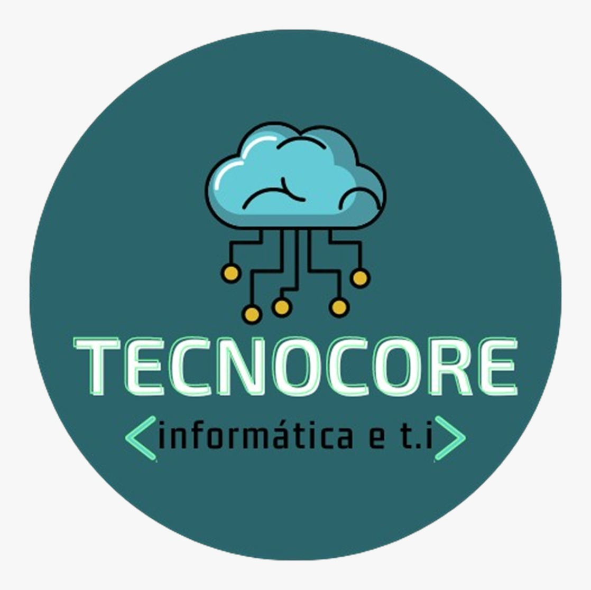

 

Desafio:
Arquitetar e sistematizar um protótipo de software para uma loja online de roupas, com foco total em uma plataforma, intuitiva e segura, além de garantir alto atendimento a clientes de todo o Brasil.
Contexto:
Na atualidade a loja de roupas fitness LUMINI não tem um sistema digital visando a ampliação de vendas e a facilidade da busca por produtos online. Todo o processo de venda é realizado de forma manual, na loja, o que torna a experiência do cliente limitada. A loja tem uma ênfase nas dificuldades de catálogos de promoções de produtos, a falta dessa aplicação online impede clientes de realizarem compras rápidas práticas e seguras.
Existem modelos de melhorias que podem ser implantadas no método de vendas online com a aplicação junto a empresa TECNOCORE para que a venda se torne algo simples e intuitivo para o cliente, de tal forma que aumente as vendas da loja.

WHY?
Quem usara o sistema?
O sistema será usado por usuários especificamente por usuários que buscam roupas de academia e fitness, interessados em praticidade, conforto e estilo durante todo o seu treino.
Além desses usuários terá a dona da loja LUMINI como administradora, que poderá acessar diversas partes do sistema onde um usuário normal não terá acesso.

Storytelling
Usuário 1 – Maria Cecilia
Para gerar uma narrativa que permita examinar melhor o contexto dos usuários e solucionar o problema de como uma WEB LOJA pode facilitar a vida dos mesmo, utilizarei a técnica de storytelling:
Era uma vez, Maria Cecília, uma mulher dinâmica e dedicada. Formada em Ciências Contábeis, ela trabalhava incansavelmente em um escritório, cumprindo uma jornada de 8 horas diárias. Além disso, equilibrava a vida profissional com as responsabilidades de cuidar de sua casa e de seus dois filhos, Pedro e Letícia, que eram sua alegria e motivação.
Mesmo com a rotina agitada, Maria Cecília sempre reservava um tempo para cuidar de si mesma. O treino na academia era o seu momento de escape, onde ela podia se desconectar do estresse do dia e renovar as energias. Mas havia um problema constante: suas roupas de academia estavam ficando velhas e desconfortáveis. Ela sabia que precisava de peças novas, mas sua agenda apertada parecia não dar margem para mais uma tarefa.
Em um dia comum, após um café da manhã agitado com a família, Maria Cecília percebeu que não tinha mais tempo para sair até o shopping, como fazia antigamente, para procurar novas roupas de academia. Ela sabia que essa era uma prioridade para ela, mas parecia impossível encaixar essa tarefa em meio a tantas responsabilidades.
Foi quando, durante o intervalo do seu programa de TV favorito, ela viu uma propaganda de uma loja online especializada em roupas de academia. "Compre no conforto da sua casa, sem sair do lugar", dizia o slogan. A ideia de não precisar sair para fazer compras a chamou a atenção. Ela poderia escolher as peças que precisava no seu próprio tempo, sem comprometer a agenda já sobrecarregada.
Animada com a possibilidade de resolver seu problema, Maria Cecília decidiu pesquisar mais. Abriu o celular e começou a buscar por outras lojas online. Havia muitas opções, mas logo ela se deparou com uma web loja que parecia se ajustar exatamente ao que ela precisava. A interface era fácil de usar, com imagens nítidas e descrições detalhadas das roupas. Além disso, as peças estavam organizadas por categorias, como "roupas de treino", "legging", "blusas esportivas". Era como se a loja entendesse suas necessidades.
O que mais a encantou foi a possibilidade de experimentar as roupas virtualmente, com um simulador de tamanho, o que a ajudava a visualizar como ficariam nela sem precisar sair de casa. Sem contar o envio rápido e as políticas de devolução, que garantiam que ela poderia trocar os itens caso não ficassem bem.
No dia seguinte, com mais tempo livre, Maria Cecília se sentou em frente ao computador e navegou pela loja. Ela conseguiu escolher algumas roupas de academia novas com apenas alguns cliques, e o melhor: sem stress. Não precisou correr até o shopping, nem se preocupar em perder horas de sua agenda. Fez suas compras no conforto de sua casa, enquanto ainda podia cuidar dos filhos e se organizar para o restante do dia.
Quando as roupas chegaram, Maria Cecília ficou surpresa com a qualidade e o caimento das peças. A sensação de estar vestindo algo confortável e adequado para seus treinos fez toda a diferença. Ela não só economizou tempo, mas também se sentiu renovada e mais motivada a seguir sua rotina de exercícios.
Maria Cecília nunca mais precisou se preocupar em encontrar um tempo para ir às lojas físicas, e agora podia focar no que realmente importava: sua saúde, seu bem-estar e o tempo com a família. A loja online não só resolveu o seu problema, mas também se tornou uma solução prática e eficiente para as suas necessidades, permitindo-lhe conciliar todos os aspectos da sua vida de forma mais tranquila e organizada.
WHO?
Personas:
A partir das hipóteses, da análise de histórias e da pesquisa com usuários, as personas foram elaboradas para representar os diferentes perfis de pessoas as que utilizarão o produto.

Mapa de Empatia:
Com o objetivo de compreender as necessidades e os desafios dos usuários, colocando-se na perspectiva deles, foi elaborado um mapa de empatia com base nas personas desenvolvidas.

Identidade Visual – Sistema
Para a identidade visual do sistema usamos a própria logo usada pela empresa LUGIMI e adaptamos com as paletas de cores desejadas.
IMAGEM IMAGEM IMAGEM IMAGEM IMAGEM IMAGEM
Wireframe
Levando em consideração os requisitos e as referências fornecidas, criamos um protótipo utilizando Wireframe, que abrange todas as funcionalidades essenciais planejadas, permitindo que sejam desenvolvidas versões iniciais de alto nível.
 Na interface de entrada do site é possível se acessar aos produtos em promoção, e outras sub funcionalidades que leva ao usuário a itens desejados.
 O menu de navegação permite que o usuário explore as categorias rapidamente. Cada categoria leva a uma página específica onde o usuário pode aplicar filtros para refinar sua busca por tamanho, cor, preço.

WIREFRAME COMPLETO
O wireframe desenvolvido visa oferecer uma visão estruturada e funcional do site, priorizando uma experiência de navegação prática e objetiva para os usuários. A página inicial destaca produtos em promoção, facilitando o acesso às ofertas e incentivando a interação do visitante. O menu de navegação foi projetado para permitir que os usuários explorem facilmente diferentes categorias, com redirecionamento para páginas específicas onde filtros avançados, como tamanho, cor e faixa de preço, podem ser aplicados. As imagens fornecidas exemplificam a disposição dos elementos e o caminho de navegação, assegurando uma experiência de uso intuitiva e eficiente.

A segunda página da prototipação:

.
Protótipo de alta fidelidade:
Empregamos o Figma como ferramenta principal para desenvolver protótipos interativos do sistema, com o objetivo de transformar as estruturas iniciais dos wireframes, em soluções mais claras e dinâmicas. Esse processo permite refinar os detalhes, melhorar a usabilidade e ajustar a interface, oferecendo uma experiência mais fluida e agradável para o usuário final.
(PROTOTIPO DE ALTA FIDELIDADE)
Para que a experiência do cliente com o protótipo seja melhor, ao entrar no link o cliente será redirecionado para uma aba com a prototipação completa.
(VIDEO EXPLICATIVO DO PROTOTIPO)

Conclusão:
Com esta iniciativa, concluímos o Projeto Integrador, coordenado pela professora e mentora Cristiane Aparecida Lana.
Iniciamos o projeto com a proposta de um projeto para atender uma cliente dona de loja de roupa de academia, o Projeto de Integrador nos desafio e nos motivou a buscar conhecimentos nunca visto antes, instigando o trabalho em equipe organizado por uma empresa fictícia que demos o nome TECNOCORE, o projeto nos ajudou a desenvolver um conhecimento do que é um dia a dia de uma equipe de desenvolvimento, desde a documentação até a etapa de prototipação do sistema desenvolvido.
Durante o desenvolvimento do projeto, uma das experiências mais enriquecedoras foi a integração entre os diferentes papéis dentro da empresa. A colaboração estreita entre os profissionais de distintas áreas — CEO, Scrum Master, Analista de Sistemas, Product Owner e Designer — foi fundamental para o sucesso e para a fluidez do processo de trabalho. Cada um desses papéis desempenha funções essenciais, mas o verdadeiro diferencial foi a capacidade de trabalhar de forma conjunta, aproveitando as forças e competências de cada membro da equipe.
Cada um foi capaz de compreender mais profundamente as responsabilidades e desafios enfrentados pelos outros, o que ajudou a fortalecer a equipe como um todo. A troca constante de informações, a adaptabilidade e o foco no resultado comum garantiram que o projeto não apenas atingisse suas metas, mas também criasse um ambiente de trabalho mais colaborativo e eficiente, essencial para o sucesso em um mundo empresarial cada vez mais dinâmico e interconectado.
Em resumo, a integração entre os diferentes cargos foi um dos maiores diferenciais do projeto. A colaboração efetiva entre CEO, Scrum Master, Product Owner, Analista de Sistemas e Designer não só contribuiu para o sucesso do projeto, mas também para o crescimento coletivo da equipe, criando um ambiente de aprendizado contínuo e alinhamento estratégico. A experiência foi uma demonstração clara de como o trabalho conjunto, respeitando as competências de cada um, pode gerar resultados excepcionais e promover uma cultura organizacional mais sólida e preparada para os desafios futuros.
Projeto foi desenvolvido:
Artur Trevizano, Estudante de Analise e Desenvolvimento de Sistema da UNIVIÇOSA.
Flavio Gabriel, Estudante de Analise e Desenvolvimento de Sistema da UNIVIÇOSA.
João Victor Ferreira, Estudante de Analise e Desenvolvimento de Sistema da UNIVIÇOSA.
Victor Ramos Cordeiro, Estudante de Analise e Desenvolvimento de Sistema da UNIVIÇOSA.
