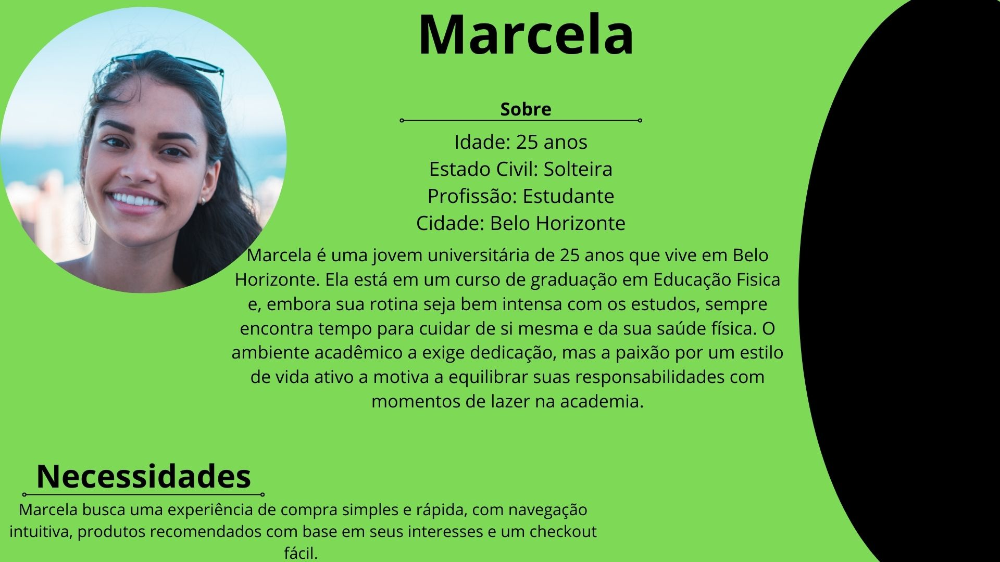
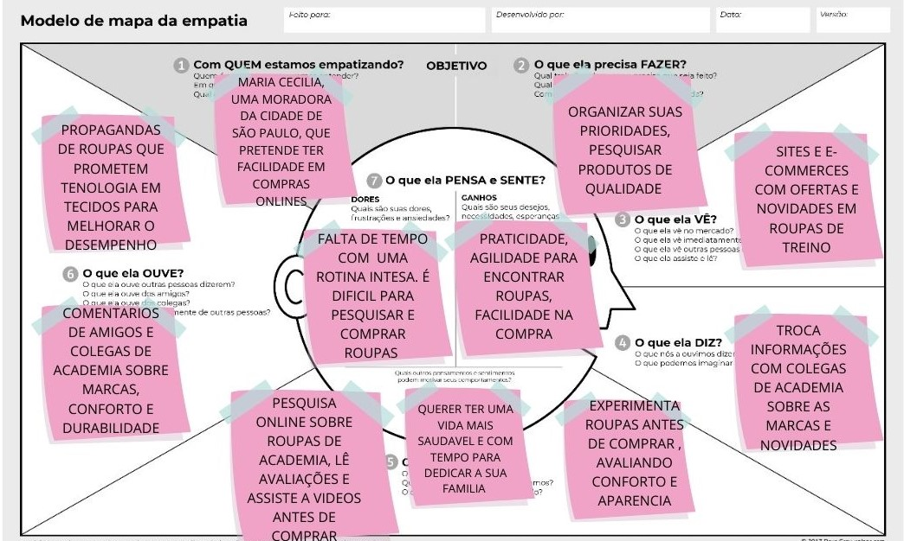
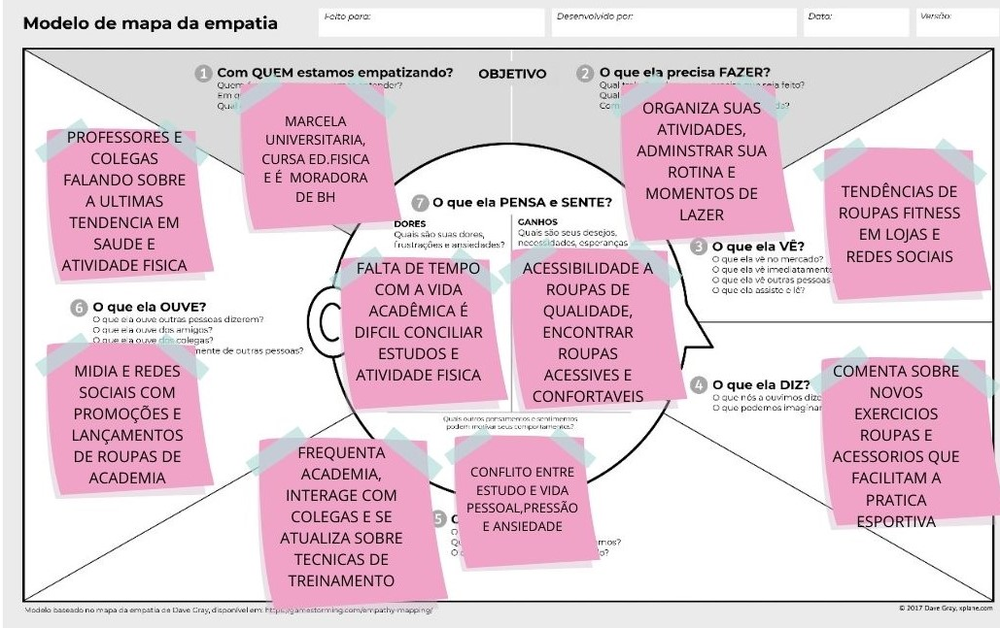
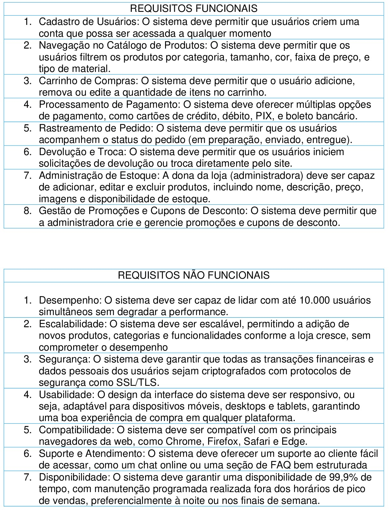
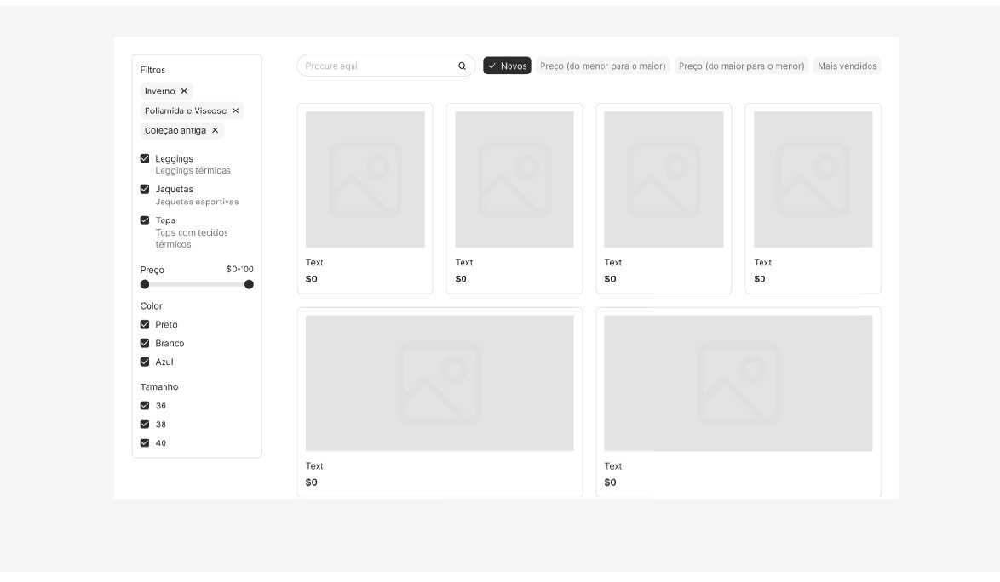

 

Figura 1- Logo da Empresa

# Desafio

Arquitetar e sistematizar um protótipo de software para uma loja online de roupas, com foco total em uma plataforma, intuitiva e segura, além de garantir alto atendimento a clientes de todo o Brasil.

# Contexto

A loja de roupas fitness LUMINI, atualmente, enfrenta desafios significativos no processo de vendas devido à ausência de um sistema digital adequado para o gerenciamento de seus produtos e a interação com seus clientes. O processo de vendas ainda é totalmente manual, realizado dentro da loja física, o que limita a experiência de compra dos clientes e dificulta a expansão do alcance da marca.
A dona da LUMINI, uma empreendedora apaixonada por moda fitness e pelo bem-estar dos seus clientes, começou suas operações de forma pequena, inicialmente vendendo suas roupas por meio de plataformas informais como o WhatsApp. Essa abordagem, embora tenha funcionado no início, não é mais suficiente para acompanhar o crescimento do mercado e as novas demandas dos consumidores que buscam praticidade e rapidez ao realizar suas compras.
Nesse contexto, surge a oportunidade de implementar melhorias substanciais no processo de vendas online por meio de uma parceria com a empresa TECNOCORE, especializada em soluções digitais. A TECNOCORE pode desenvolver uma plataforma de e-commerce personalizada que tornará o processo de compra mais simples, rápido e seguro para os clientes. Um sistema de catálogo bem estruturado permitirá que os consumidores encontrem facilmente os produtos, aproveitem promoções e realizem suas compras sem complicação, diretamente de seus dispositivos móveis ou desktops.
Essa transição para o digital não só melhorará a experiência do cliente, mas também permitirá à LUMINI ampliar seu alcance, aumentar as vendas e fidelizar seus clientes. A automação das vendas online também possibilitará um controle mais eficiente do estoque e das entregas, otimizando os processos internos da loja. Com o suporte da TECNOCORE, a LUMINI poderá se destacar no mercado competitivo de roupas fitness, oferecendo aos seus clientes uma experiência de compra moderna e de alta qualidade.
O futuro da LUMINI, com a integração digital, promete ser mais dinâmico, com novas oportunidades de expansão e inovação no setor de moda fitness.

# Storytelling

Gabriela Dini, apaixonada pelo universo fitness. Desde cedo, ela sempre acreditou que a prática de exercícios não era apenas uma forma de melhorar a saúde, mas uma maneira de transformar a vida das pessoas. E foi com esse espírito de transformação que ela fundou sua loja Lumini.

A Lumini nasceu como um pequeno espaço físico, onde Gabriela oferecia roupas de academia de qualidade, com um toque de estilo único e conforto. Ela conhecia o gosto de suas clientes e sabia exatamente o que elas precisavam para se sentir confiantes e bem-sucedidas em suas atividades físicas. O boca a boca logo fez a loja se tornar um ponto de referência na cidade, e Gabriela, com seu carisma e dedicação, conquistou um público fiel.

Porém, a empresária sabia que a evolução era inevitável. As vendas por WhatsApp estavam crescendo, mas o alcance ainda era limitado. Ela queria que a Lumini chegasse a mais lugares, que as mulheres de todo o Brasil pudessem descobrir as peças incríveis da loja sem precisar viajar até Uba. Foi então que, em busca de uma solução, ela se deparou com a Tecnocore.

A Tecnocore se mostrou a parceira ideal para esse salto digital. Com um time especializado em e-commerce e design de lojas virtuais, a Tecnocore ajudou Gabriela a criar uma plataforma online moderna, fácil de usar e visualmente deslumbrante. O objetivo era simples: tornar a Lumini uma referência no mercado online de roupas de academia, com uma experiência de compra impecável e eficiente.

A parceria entre Gabriela e a Tecnocore começou com a criação de um site perfeito para o estilo da Lumini. Cada detalhe foi pensado para refletir a essência da loja: um espaço online acolhedor, que transmitisse a sensação de estar em um lugar especial. A navegação era intuitiva, as imagens das roupas eram de alta qualidade e, claro, a plataforma foi otimizada para ser acessada de qualquer dispositivo.

Logo, as clientes começaram a perceber a diferença. Com um design que combinava praticidade e elegância, o novo e-commerce da Lumini oferecia uma experiência de compra fácil e segura. A Tecnocore ainda se encarregou de otimizar a loja para dispositivos móveis, garantindo que a Gabriela conseguisse atender as clientes de qualquer lugar, a qualquer hora.

Hoje, a Lumini é muito mais que uma loja de roupas de academia. Ela é um símbolo de transformação e empoderamento feminino, com roupas que acompanham a mulher moderna, tanto nos treinos quanto no dia a dia. A loja online, criada com a ajuda da Tecnocore, continua crescendo e encantando clientes que buscam qualidade, estilo e conforto. E Gabriela, com o coração cheio de gratidão, sabe que sua jornada de sucesso está apenas começando.

## WHY?

# Quem usara o sistema?

O sistema será usado por usuários especificamente por usuários que buscam roupas de academia e fitness, interessados em praticidade, conforto e estilo durante todo o seu treino.
Além desses usuários terá a dona da loja LUMINI como administradora, que poderá acessar diversas partes do sistema onde um usuário normal não terá acesso.

## WHO?

# Personas

A partir das hipóteses, da análise de histórias e da pesquisa com usuários, as personas foram elaboradas para representar os diferentes perfis de pessoas as que utilizarão o produto.

# Usuário 1 – Maria Cecilia

 

Figura 2- Maria Cecilia 

Para gerar uma narrativa que permita examinar melhor o contexto dos usuários e solucionar o problema de como uma WEB LOJA pode facilitar a vida dos mesmo, utilizarei a técnica de storytelling:
Era uma vez, Maria Cecília, uma mulher dinâmica e dedicada. Formada em Ciências Contábeis, ela trabalhava incansavelmente em um escritório, cumprindo uma jornada de 8 horas diárias. Além disso, equilibrava a vida profissional com as responsabilidades de cuidar de sua casa e de seus dois filhos, Pedro e Letícia, que eram sua alegria e motivação.
Mesmo com a rotina agitada, Maria Cecília sempre reservava um tempo para cuidar de si mesma. O treino na academia era o seu momento de escape, onde ela podia se desconectar do estresse do dia e renovar as energias. Mas havia um problema constante: suas roupas de academia estavam ficando velhas e desconfortáveis. Ela sabia que precisava de peças novas, mas sua agenda apertada parecia não dar margem para mais uma tarefa.
Em um dia comum, após um café da manhã agitado com a família, Maria Cecília percebeu que não tinha mais tempo para sair até o shopping, como fazia antigamente, para procurar novas roupas de academia. Ela sabia que essa era uma prioridade para ela, mas parecia impossível encaixar essa tarefa em meio a tantas responsabilidades.
Foi quando, durante o intervalo do seu programa de TV favorito, ela viu uma propaganda de uma loja online especializada em roupas de academia. "Compre no conforto da sua casa, sem sair do lugar", dizia o slogan. A ideia de não precisar sair para fazer compras a chamou a atenção. Ela poderia escolher as peças que precisava no seu próprio tempo, sem comprometer a agenda já sobrecarregada.
Animada com a possibilidade de resolver seu problema, Maria Cecília decidiu pesquisar mais. Abriu o celular e começou a buscar por outras lojas online. Havia muitas opções, mas logo ela se deparou com uma web loja que parecia se ajustar exatamente ao que ela precisava. A interface era fácil de usar, com imagens nítidas e descrições detalhadas das roupas. Além disso, as peças estavam organizadas por categorias, como "roupas de treino", "legging", "blusas esportivas". Era como se a loja entendesse suas necessidades.
O que mais a encantou foi a possibilidade de experimentar as roupas virtualmente, com um simulador de tamanho, o que a ajudava a visualizar como ficariam nela sem precisar sair de casa. Sem contar o envio rápido e as políticas de devolução, que garantiam que ela poderia trocar os itens caso não ficassem bem.
No dia seguinte, com mais tempo livre, Maria Cecília se sentou em frente ao computador e navegou pela loja. Ela conseguiu escolher algumas roupas de academia novas com apenas alguns cliques, e o melhor: sem stress. Não precisou correr até o shopping, nem se preocupar em perder horas de sua agenda. Fez suas compras no conforto de sua casa, enquanto ainda podia cuidar dos filhos e se organizar para o restante do dia.
Quando as roupas chegaram, Maria Cecília ficou surpresa com a qualidade e o caimento das peças. A sensação de estar vestindo algo confortável e adequado para seus treinos fez toda a diferença. Ela não só economizou tempo, mas também se sentiu renovada e mais motivada a seguir sua rotina de exercícios.
Maria Cecília nunca mais precisou se preocupar em encontrar um tempo para ir às lojas físicas, e agora podia focar no que realmente importava: sua saúde, seu bem-estar e o tempo com a família. A loja online não só resolveu o seu problema, mas também se tornou uma solução prática e eficiente para as suas necessidades, permitindo-lhe conciliar todos os aspectos da sua vida de forma mais tranquila e organizada.

# Usuário 2 – Marcela

 

Figura 3- Marcela 

Marcela tem 25 anos e mora em Belo Horizonte, uma cidade que combina a vibração de um grande centro urbano com a tranquilidade de um ambiente acolhedor. Solteira e dedicada à sua graduação em Educação Física, ela encara cada desafio da vida universitária com determinação. A rotina de estudos intensos demanda muito de seu tempo e energia, mas Marcela tem um grande aliado: sua paixão por um estilo de vida saudável e ativo.
Desde pequena, sempre foi apaixonada por esportes e pelo cuidado com o corpo. Com o tempo, essa paixão se transformou em um compromisso, e agora, no curso de Educação Física, ela sente que está no lugar certo para explorar ainda mais esse universo. Contudo, a vida universitária não é simples. As provas, os projetos e os compromissos acadêmicos muitas vezes exigem horas de dedicação, mas Marcela aprendeu a arte de equilibrar suas responsabilidades com seus momentos de lazer e autocuidado.
Ao contrário de muitas pessoas que acabam se deixando levar pelo cansaço ou pelo estresse, ela considera a prática de atividades físicas um pilar essencial para sua saúde mental e física. Seja para desestressar após um dia de aulas, seja para manter a energia e o foco necessários para os estudos, Marcela sabe que, ao dedicar um tempo para si mesma, está investindo diretamente em seu desempenho e bem-estar.
Ela é presença constante na academia, onde se desafia em treinos que vão desde musculação até aulas de dança e pilates. Mas, além da academia, Marcela também adora sair para correr nos parques da cidade, praticar yoga ou até mesmo se reunir com amigos para atividades ao ar livre. Para ela, o exercício não é uma obrigação, mas uma escolha prazerosa que contribui para o equilíbrio entre corpo e mente.
Embora a agenda cheia de compromissos acadêmicos seja um desafio constante, ela tem aprendido a ser organizada. Usando ferramentas como planners e apps de produtividade, Marcela consegue otimizar o tempo e garantir que sua vida pessoal não seja deixada de lado. Ela sabe que manter o equilíbrio entre o estudo e o lazer é fundamental, e com isso, consegue manter uma boa saúde mental, o que reflete diretamente no seu desempenho acadêmico.
Sua escolha pela Educação Física não é apenas uma profissão, mas uma paixão que orienta sua vida. Ela entende que o conhecimento adquirido na faculdade não só a prepara para ser uma futura profissional da área, mas também fortalece seus próprios hábitos e atitudes. Sua dedicação aos estudos e sua visão holística sobre o corpo e a saúde a tornam uma inspiração para colegas e amigos. A busca constante por aprender mais sobre o funcionamento do corpo humano, as diferentes modalidades de exercício e como elas podem beneficiar as pessoas a motiva a seguir seu caminho com muito mais convicção.
No fim do dia, a jovem universitária entende que seu equilíbrio é uma escolha diária. Em meio aos desafios de sua graduação e às responsabilidades que carrega, ela nunca deixa de se cuidar, de buscar o que a faz sentir-se bem. Seu amor por um estilo de vida saudável não só a prepara para ser uma profissional de sucesso, mas a mantém motivada e com energia para aproveitar todas as possibilidades que a vida tem a oferecer.

# Mapa de Empatia

Com o objetivo de compreender as necessidades e os desafios dos usuários, colocando-se na perspectiva deles, foi elaborado um mapa de empatia com base nas personas desenvolvidas.

 

Figura 4- Mapa de Empatia da Maria Cecilia

Maria Cecília busca praticidade nas compras online de roupas de treino, influenciada por propagandas sobre tecnologias nos tecidos e recomendações de colegas sobre conforto e durabilidade. Com uma rotina intensa, ela tem pouco tempo para pesquisar e valoriza a agilidade nas compras. Ela troca informações sobre novidades com amigos e ainda considera importante experimentar as roupas antes de comprar, priorizando qualidade, conforto e aparência. Além disso, deseja equilibrar uma vida saudável com mais tempo para a família.

 

Figura 5- Mapa de Empatia da Marcela

Uma universitária de Educação Física de BH, reflete suas principais preocupações e influências. Ela enfrenta a dificuldade de conciliar os estudos com a prática de atividades físicas, devido à falta de tempo. Ao mesmo tempo, está constantemente atualizada sobre as últimas tendências em saúde e fitness, tanto por meio de suas interações com colegas e professores quanto pelas redes sociais e lojas de roupas de academia. Embora tenha acesso a novas roupas e acessórios de treino, ela enfrenta o desafio de encontrar opções acessíveis e confortáveis. Marcela organiza sua rotina entre estudos, exercícios e lazer, lidando com a pressão e a ansiedade relacionadas a essa conciliação.

# Identidade Visual

Para a identidade visual do sistema usamos a própria logo usada pela empresa LUGIMI e adaptamos com as paletas de cores desejadas.

# Requisitos

Para criar um e-commerce que atendesse às necessidades da Lumini e ao mesmo tempo proporcionasse uma experiência de compra excelente para as clientes, a Tecnocore focou em dois tipos essenciais de requisitos: funcionais e não funcionais. Cada escolha foi feita com base nas necessidades do negócio, no público-alvo e nas melhores práticas do mercado digital.

 

Figura 5- Mapa de Empatia da Marcela

# Wireframe

Levando em consideração os requisitos e as referências fornecidas, criamos um protótipo utilizando Wireframe, que abrange todas as funcionalidades essenciais planejadas, permitindo que sejam desenvolvidas versões iniciais de alto nível.
 Na interface de entrada do site é possível se acessar aos produtos em promoção, e outras sub funcionalidades que leva ao usuário a itens desejados.
 O menu de navegação permite que o usuário explore as categorias rapidamente. Cada categoria leva a uma página específica onde o usuário pode aplicar filtros para refinar sua busca por tamanho, cor, preço.

# Wireframe Completo

 

Figura 6- Prototipo

O wireframe desenvolvido visa oferecer uma visão estruturada e funcional do site, priorizando uma experiência de navegação prática e objetiva para os usuários. A página inicial destaca produtos em promoção, facilitando o acesso às ofertas e incentivando a interação do visitante. O menu de navegação foi projetado para permitir que os usuários explorem facilmente diferentes categorias, com redirecionamento para páginas específicas onde filtros avançados, como tamanho, cor e faixa de preço, podem ser aplicados. As imagens fornecidas exemplificam a disposição dos elementos e o caminho de navegação, assegurando uma experiência de uso intuitiva e eficiente.

# A segunda página da prototipação

 

Figura 7- Prototiopo

Protótipo de alta fidelidade:
Empregamos o Figma como ferramenta principal para desenvolver protótipos interativos do sistema, com o objetivo de transformar as estruturas iniciais dos wireframes, em soluções mais claras e dinâmicas. Esse processo permite refinar os detalhes, melhorar a usabilidade e ajustar a interface, oferecendo uma experiência mais fluida e agradável para o usuário final.

<a href="https://www.figma.com/proto/vEHkzU0tXlgkPKdtVwk8MA/Untitled?node-id=86-29&node-type=canvas&t=GHpChBIGIKYDoDcO-0&scaling=min-zoom&content-scaling=fixed&page-id=0%3A1&starting-point-node-id=86%3A29">Prototipo Figma</a>

Para que a experiência do cliente com o protótipo seja melhor, ao entrar no link o cliente será redirecionado para uma aba com a prototipação completa.
(VIDEO EXPLICATIVO DO PROTOTIPO)

# Conclusão

Com esta iniciativa, concluímos o Projeto Integrador, coordenado pela professora e mentora Cristiane Aparecida Lana.
Iniciamos o projeto com a proposta de um projeto para atender uma cliente dona de loja de roupa de academia, o Projeto de Integrador nos desafio e nos motivou a buscar conhecimentos nunca visto antes, instigando o trabalho em equipe organizado por uma empresa fictícia que demos o nome TECNOCORE, o projeto nos ajudou a desenvolver um conhecimento do que é um dia a dia de uma equipe de desenvolvimento, desde a documentação até a etapa de prototipação do sistema desenvolvido.
Durante o desenvolvimento do projeto, uma das experiências mais enriquecedoras foi a integração entre os diferentes papéis dentro da empresa. A colaboração estreita entre os profissionais de distintas áreas — CEO, Scrum Master, Analista de Sistemas, Product Owner e Designer — foi fundamental para o sucesso e para a fluidez do processo de trabalho. Cada um desses papéis desempenha funções essenciais, mas o verdadeiro diferencial foi a capacidade de trabalhar de forma conjunta, aproveitando as forças e competências de cada membro da equipe.
Cada um foi capaz de compreender mais profundamente as responsabilidades e desafios enfrentados pelos outros, o que ajudou a fortalecer a equipe como um todo. A troca constante de informações, a adaptabilidade e o foco no resultado comum garantiram que o projeto não apenas atingisse suas metas, mas também criasse um ambiente de trabalho mais colaborativo e eficiente, essencial para o sucesso em um mundo empresarial cada vez mais dinâmico e interconectado.
Em resumo, a integração entre os diferentes cargos foi um dos maiores diferenciais do projeto. A colaboração efetiva entre CEO, Scrum Master, Product Owner, Analista de Sistemas e Designer não só contribuiu para o sucesso do projeto, mas também para o crescimento coletivo da equipe, criando um ambiente de aprendizado contínuo e alinhamento estratégico. A experiência foi uma demonstração clara de como o trabalho conjunto, respeitando as competências de cada um, pode gerar resultados excepcionais e promover uma cultura organizacional mais sólida e preparada para os desafios futuros.

# Projeto foi desenvolvido

### Artur Trevizano, Estudante de Analise e Desenvolvimento de Sistema da UNIVIÇOSA.

### Flavio Gabriel, Estudante de Analise e Desenvolvimento de Sistema da UNIVIÇOSA.

### João Victor Ferreira, Estudante de Analise e Desenvolvimento de Sistema da UNIVIÇOSA.

### Victor Ramos Cordeiro, Estudante de Analise e Desenvolvimento de Sistema da UNIVIÇOSA. <a href="https://github.com/victor-rc1">Github</a>
